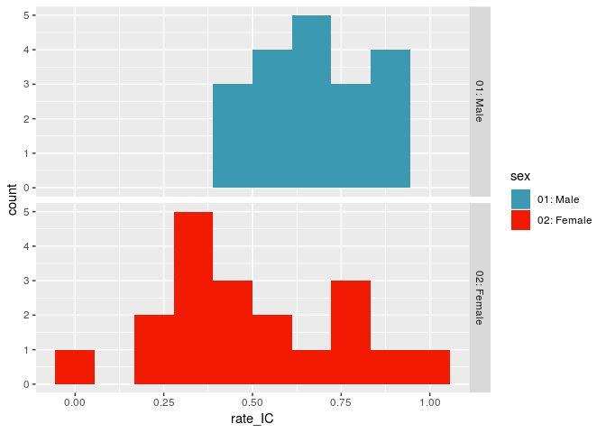
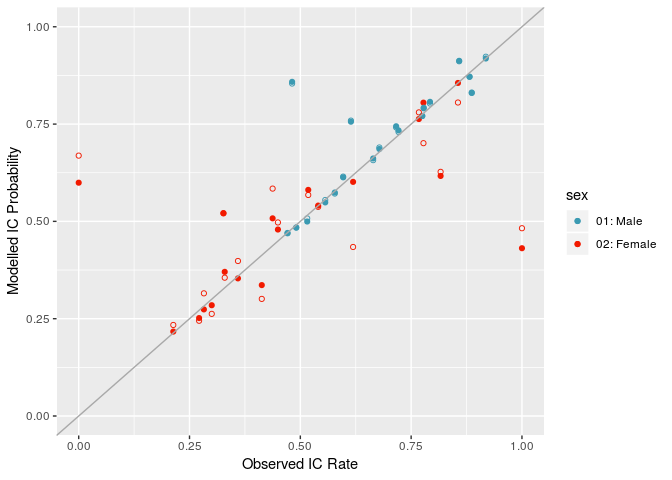

  
# Introduction
Logistic regression is a widely used method to analyse data where the variable of interest (the *response variable*) takes one of two categorical values. For instance, in the context of court outcomes this could be whether or not a defendant receives an immediate custodial sentence.

The technique is used in both:

* **Inferential Statistics** - where the aim is to identify/explain the variables that explain immediate custody, and to test hypotheses against them. For instance, a justice policy maker may be interested in understanding whether or not gender has an impact on immediate custody rates, and whether this is appropriate.

* **Predictive Statistics** - where the aim is to construct a model that best predicts whether or not a defendant will be given an immediate custodial sentence. For instance, a probation officer working in a court may wish to make an assessment as to the likely outcome of a trial hearing to guide the paper work they prepare.

In predictive statistics we can often use models (whether they are logistic regression, or otherwise) as blackboxes. A common strategy being to define a series of models, test how well they perform against a set of unobserved data, and choose the model that shows the best balance of performance and ease of implementation. Why the model works well is frequently of less interest (though applications with ethical contexts may require greater transparency).

The use of such models for inference, however, neccessitates a greater understanding of the machinery behind the model. If we are going to claim that a certain factor drives immediate custody rates, and subsequently advise policy makers, then we must be transparent about the assumptions of the model that drive this result.

In this note we demonstrate the impact of using logistic regression as a blackbox in an inferential setting, and hope this acts as a cautionary tale to analysts who have grown up on a diet of predictive problems who are moving into the world of inference!

# A Brief Overview of The Logistic Model

In this section we briefly introduce the logistic model; following the custom of most resources on the topic, we intentionally do so in a fairly non-transparent way. The point being, at this stage, to provide the information in the format that most newcomers to the topic are likely to find it.

In other words, the aim of this section is to provide you with enough information to answer a basic exam question on logistic regression, but leave you without any intuition of the real idea as to what its about: which will put you in a perfect position to happily use it as a black box! Unfortunately, for this purpose equations cannot be avoided, but we will keep them to a minimum.

Of course, if you already have some knowledge of logistic regression, then you can skip the below!

The logistic model is aimed at answering the following question: given information (input variables) $x_1, x_2, \ldots, x_n$ and an outcome (response variable) $y$ which takes the values $y = 0$, or $y=1$, what is the probability that $y$ does in fact equal $1$? The use of $0/1$ can encode any response that can take one of two values, such as in our example $1$ may denote an immediate custodial sentence, whilst $0$ denotes any other outcome.

In mathematical terms, the aim is to define some function $p$ which takes as its inputs the observed values $x_1,\ldots, x_n$ and returns our guess of the probability that $y = 1$. To abbreviate formulae going forward we use the notation $\underline x = (x_1,\ldots,x_n)$; so our aim is to define a function

$$ p(\underline x) = \mathbf P[y = 1 | \underline x]. $$
There are many ways to define such a function $p$, and some will work better than others. At a first instance, scientists often turn to linear models as a first step due to their ease of a) interpretation, and b) implementation. That is we might suppose that

$$ p(\underline x) = \beta_0 + \beta_1 x_1 + \cdots + \beta_n x_n,$$
and then look to find the values $\beta_0,\ldots, \beta_n$ that best fit the data. In the context of guessing a probability, linear models often fail because they cannot naturally be constrained to satisfy the requirement of returning a value between $0$ and $1$, but we know that the true probability must have this constraint. A half-way solution to this problem is to assume not that $p$ is linear, but that some transformation of it is.

Logistic regression does exactly this. It assumes that $p$ has the property that

$$ \log \frac{p(\underline x)}{1 - p(\underline x)} = \beta_0 + \beta_1 x_1 + \cdots + \beta_n x_n, $$
which on rearranging is equivalent to 

$$p(\underline x) = \bigg( 1 + \exp(\beta_0 + \beta_1x_1 + \cdots \beta_n x_n) \bigg)^{-1}.$$
We have obtained a formula for $p$ that satisfies the requirement to be between $0$ and $1$, is computationally efficient to solve (not something we will discuss, but of hisoric importance in the time before greater computing power and still useful for fitting models quickly), and which retains some level of interpretability.

The interpretation comes from looking not at the probability $p(\underline x)$ itself but at the odds: which is the ratio $p(\underline x) /(1-p(\underline x))$, which we encountered above. The odds describe how likely it is that $y = 1$; as an example suppose that $p(\underline x) = 3/4$, then the odds are $p(\underline x) /(1-p(\underline x)) = 3$, which in the gambling world is often expressed as $3$-to-$1$, and represents the fact that for every $3$ observations of $y = 1$, you should expect $1$ observation of $y=0$.

Under the logistic model, the odds can be written as

$$ \frac{ p(\underline x)}{1- p(\underline x)} = e^{\beta_0} \cdot e^{\beta_1 x_1}  \cdots  e^{\beta_n x_n}.$$

To understand why this might be an appropriate/interpretable model we consider our application and suppose that variable $x_1$ encodes whether a defendant is male or female: for sake of example $x_1 = 1$ if they are female, and $x_1 = 0$ if they are male. Suppose we had data on two defendants which is identical, except for their gender, so that $ \underline x = (1, x_2, \ldots, x_n)$ is the data for the female defendant, and $\underline y = (0,x_2, \ldots, x_n)$ is the data for the male defendant. Then the logistic model implies that the odds that the female is given an immediate custodial sentence are equal to those of the male, but multiplied by some constant factor

$$\frac{ p(\underline x)}{1- p(\underline x)}  = e^{\beta_1} \times \frac{ p(\underline y)}{1- p(\underline y)}.$$
We now put this to practice on actual data of immediate custody rates in the Crown court.

# A First Model of the Impact of Gender on Immediate Custody Rates

## Introducing the data
The data we will use is the Ministry of Justice's published data of [*Court Outcomes by Police Force Area*](https://www.gov.uk/government/statistics/criminal-justice-system-statistics-quarterly-december-2017). We work with a prepared version of this data and focus on a subset of defendants:

* Those from 2017,
* who are people (as opposed to companies etc.),
* are adults,
* heard in the Crown court,
* for a triable-either-way or indictable only trial (eg. excluding summary motoring / non-motoring offences),
* who were convicted of committing a crime,
* and were sentenced for it.

The aim of this analysis is to understand how variables correlate to immediate custody rates, and in particular gender; as this work is focused on illustrating the use of logistic regression, we make a number of (unrealistic) simplifying assumptions and specifically do not look at:

* The police force area (PFA) to which the case is attributed,
* the quarter of the year (eg. for any seasonal effects), 
* the age of the defendant,
* the ethnicity of the defendent,
* the full detail of the offence committed, so distinguish cases only up to the level of type (eg. Triable-Either-Way or Indictable Only) and group (eg. Violence Against the Person),
* all possible sentencing outcomes, only whether or not it was an immediate custodial sentence,
* full details of the sentence, or in the case of immediate custodial sentences, the sentence length.

The data we use is illustrated below, where we display the first 8 rows.

sex          offence_type             offence_group                      count_IC   count     rate_IC
-----------  -----------------------  --------------------------------  ---------  ------  ----------
01: Male     01: Indictable only      01: Violence against the person        1675    1889   0.8867125
01: Male     02: Triable Either Way   01: Violence against the person        3818    6399   0.5966557
02: Female   01: Indictable only      01: Violence against the person         129     158   0.8164557
02: Female   02: Triable Either Way   01: Violence against the person         254     771   0.3294423
01: Male     01: Indictable only      02: Sexual offences                    1618    1835   0.8817439
01: Male     02: Triable Either Way   02: Sexual offences                    1668    2459   0.6783245
02: Female   01: Indictable only      02: Sexual offences                      21      27   0.7777778
02: Female   02: Triable Either Way   02: Sexual offences                      26      42   0.6190476

The `count` column denotes the total number of defendants in the data, whilst `count_IC` denotes those sentenced to immediate custody. Finally `rate_IC` denotes the immediate custody rate, which is the ratio of `count_IC` to `count.

**Note: I have chosen not to host the MOJ's raw data on github as it is readily available from the link above; the simplified data for this example is, however, hosted [here](https://github.com/odaniel1/PFA_Court_Outcomes/blob/master/Data/adult_gender_IC_data.csv). Moreover, the code to generate this from the MOJ raw data is available [here](https://github.com/odaniel1/PFA_Court_Outcomes/blob/master/Scripts/generate_simple_adult_gender_data.R).**

As a first piece of exploratory analysis, the histograms below show how immediate custody rates vary, and in particular highlights that gender does appear to have an impact on this.

## Fitting a first model
The first model we fit we will do so naively, using logistic regression as a blackbox. Note that our intention here will not be to go into detail about the mechanics of fitting a logistic regression model in R, or diagnostics about model fit: both of which are well covered for instance in Chapter 2 of [An Introduction to Statistical Learning](https://www-bcf.usc.edu/~gareth/ISL/ISLR%20Seventh%20Printing.pdf)

Rather, our aim is to demonstrate the issue in quickly fitting these models naively. So to this end, we simply observe that by performing a logistic regression out-of-the-box on this data, we obtain the following estimated coefficients (for simplicity we are deliberately not showing the wider model fit diagnostics such as standard errors or p-values):

term                                                       estimate
------------------------------------------------------  -----------
(Intercept)                                               1.5846052
sex02: Female                                            -1.0639611
offence_type02: Triable Either Way                       -1.1162703
offence_group02: Sexual offences                          0.3310899
offence_group03: Robbery                                  0.8998005
offence_group04: Theft Offences                           0.7452852
offence_group05: Criminal damage and arson               -0.2475703
offence_group06: Drug offences                            0.1828488
offence_group07: Possession of weapons                   -0.1804481
offence_group08: Public order offences                   -0.5910393
offence_group09: Miscellaneous crimes against society    -0.5314832
offence_group10: Fraud Offences                          -0.4378809

The intercept term corresponds to the scenario of a defendant who is male, who has been convicted in an indictable only violence against the person trial. The coefficient $\beta_0 = 1.585$ implies that the odds of such a defendant receiving an immediate custodial sentence are equal to 
$$\exp(\beta_0) = 4.877,$$ 
which in turn implies that the probability is $0.83$.

As discussed in the introduction, if we wanted instead to know the odds for a female offender with the same offence type / group, then this is easily obtained by multiplying the odds above by the appropriate coefficient for female defendants. Denoting $\beta_F = -1.064$ for the coefficient for indicating that a defendant is female, then the odds become:
$$ \exp(\beta_F) \exp(\beta_0) = 1.6831115$$
and subsequently the probability is $0.627$.

So the model says that no matter what the odds are for males, the equivalent odds for a female defendant are always $\exp( \beta_F) = 0.345$ times this.

## Testing model fit
We can conduct an initial analysis of model fit without having to know anything about test diagnoistics for statistical models. We do this by seeing how well the modelled probabilities of receiving an immediate custodial sentence model match with the observed frequencies in the data.

We see that whilst the model does generally fit the overall data quite well, there is an obvious pattern that the model does not fit the data to female defendants as well as it does to males.

If we think about this naively we might look to explain this away by claiming that the difference is due to the fact that within each offence there are substantially fewer female defendants than there are male, so we would expect the female data to be more volatile.

To a certain extent this explanation is meaningful: a detailed analysis of both the confidence intervals for the logistic regression parameters, as well as for the original observed counts would be an important step in any formal statistical evaluation.

However, our interest in this note is to raise awareness of a much more significant limitation. That is - have we systematically built in an incorrect assumption about females into the model?

# Backpedalling
Reflecting on the conclusions of the section **Fitting a first model**, there we stated that under the logistic regressiono model above:

> "no matter what the odds are for males, the equivalent odds for a female defendant are always $\exp( \beta_F) = 0.345$ times this."

This encapsulates two assumptions that are at the heart of logistic regression, which in our context can be stated as:

1. The discount rate for females as compared to males is constant across all offence groups/types,
2. and this discount should be applied to the odds, not the probabilities.

The second assumption is really inherent to the choice of a logistic regression model - that each variable contributes a multiplicative factor to the odds, or equivalently that the logarithm of the odds is linear in the predictors. If we have reason not to like this assumption then there is little to do but to either live with it, or seek an alternative model.

The first assumption is not so much about the appropriateness of the modelling technique, but more our basic assumption of the problem. By implementing this model we have implicitly decided that the extent to which female immediate custody rates differ from those of men does not depend on the offence type.

Without looking at the data I would not (personally!) choose to make this assumption without first actively testing it. For instance, do we know that within these offence groups woman and men are commiting the same actual crimes (eg. if a woman does commit a sex offence, beyond the headline title, are these really likely to be similar offences, with similar punishments?).

We can test this rather easily by returning to the original raw data (eg. without the hindsight of our first logistic regression model). For each offence type/group we can calculate the (implied) odds for both males and female based on the count data. For instance, for Male indictable only violence against the person defendants the observed immediate custody rate was 0.887, with implied odds 7.827.

The plot below demonstrates that whilst the male and female odds are correlated across offence groups, assuming that the female odds are a constant times the male ones does not provide a very good fit (the dashed line depicts the implicit relationship assumed in our first logistic regression model, where female defendants were modelled to have odds equal to men, discounted by 0.345).

# A Second Attempt
Having decided that it is not appropriate to assume that gender has the same multiplicative affect on all offence groups/types, how can we now fit a logistic regression model that takes this into account?

The answer is simple - fit two models: one for female defendants and a second for male. In practice there is a much more elegant way to do this than to literally fit two models, but as reiterated before, our aim in this note is to highlight the issue of the implicit assumptions we've made, not to address implementation methods.

Doing this, we obtain model fits for both a male and female logistic regression model.

Table: Logistic regression coefficients for Male only data

term                                                       estimate
------------------------------------------------------  -----------
(Intercept)                                               1.5929198
offence_type02: Triable Either Way                       -1.1325817
offence_group02: Sexual offences                          0.3211042
offence_group03: Robbery                                  0.8286452
offence_group04: Theft Offences                           0.7516752
offence_group05: Criminal damage and arson               -0.2648820
offence_group06: Drug offences                            0.2101685
offence_group07: Possession of weapons                   -0.1613835
offence_group08: Public order offences                   -0.5792958
offence_group09: Miscellaneous crimes against society    -0.5240392
offence_group10: Fraud Offences                          -0.4618284

Table: Logistic regression coefficients for Female only data

term                                                       estimate
------------------------------------------------------  -----------
(Intercept)                                               0.4757287
offence_type02: Triable Either Way                       -1.0063585
offence_group02: Sexual offences                          0.9424191
offence_group03: Robbery                                  1.3036083
offence_group04: Theft Offences                           0.6933624
offence_group05: Criminal damage and arson               -0.1492410
offence_group06: Drug offences                           -0.0728072
offence_group07: Possession of weapons                   -0.4445153
offence_group08: Public order offences                   -0.7532894
offence_group09: Miscellaneous crimes against society    -0.5594414
offence_group10: Fraud Offences                          -0.3910949

As before we will not perform a full diagnostic test of model fit, but rather just see how well this new model fits to the original data from which it was derived. And most importantly whether it fits the data better.

The plot below shows the observed immediate custody rates against the probabilities prediced from the new model (solid circles) as well as the original result (hollow circles).

Somewhat unexpecteldy the model doesn't appear to have changed all that much; as before the male data generally fits well to the observed data (largely lies on the diagonal line), and this data has barely changed from the original model (hard to perceive hollow circles). On the other hand the data for females has changed more significantly, but in some cases the fit appears to have worsened not improved.

# ... The Exam Question!
The lack of fit can be explained entirely using information in this note; can you spot the issue?!
